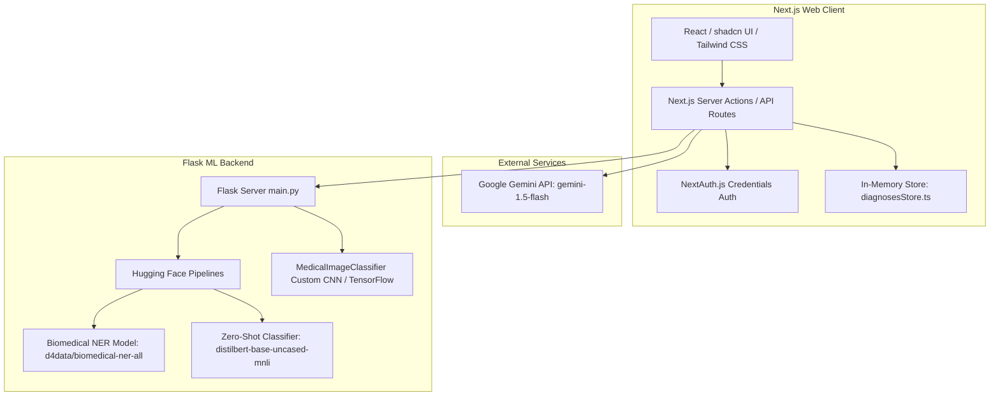
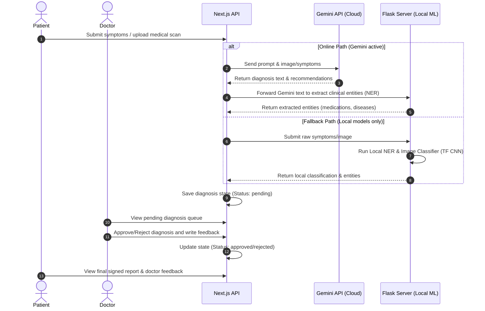
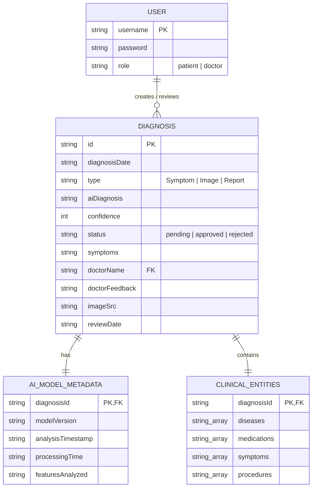

# Medi - AI-Powered Medical Diagnosis Platform

Medi is a secure, role-based medical diagnosis platform that integrates a **Next.js frontend** and a **Python Flask ML backend** powered by local **Hugging Face clinical models** and the **Google Gemini API**. Patients can upload text-based symptoms or PDF/TXT medical reports for structured clinical entity extraction and disease mapping, which doctors can dynamically review, annotate, and approve.

---

## 🛠️ Tech Stack & System Architecture



- **Frontend Tech Stack**: Next.js 15 (App Router), React, TailwindCSS, shadcn UI, NextAuth.js
- **Shared Storage**: In-memory thread-safe diagnoses queue (`diagnosesStore.ts`)
- **Backend Tech Stack**: Flask, PyTorch, PyPDF, TensorFlow, Hugging Face Transformers

---

## 🤖 AI Models Used

The system implements a hybrid cloud-local AI intelligence layout:

1. **Google Gemini API (`gemini-1.5-flash`)**
   - **Role**: Primary Multimodal Engine
   - **Usage**: Analyzes raw symptoms, medical reports, and medical scan images. Performs generative analysis to produce structural diagnosis briefs, confidence bounds, and treatment recommendations.

2. **Biomedical NER (`d4data/biomedical-ner-all`)**
   - **Role**: Local Clinical Entity Extraction (Hugging Face Pipeline)
   - **Usage**: Automatically parses raw reports and AI findings to isolate medical terminology, cataloging them into **Diseases**, **Symptoms**, **Medications**, and **Procedures**.

3. **Zero-Shot Classifier (`typeform/distilbert-base-uncased-mnli`)**
   - **Role**: NLI-based Classification (Hugging Face Pipeline)
   - **Usage**: Maps natural language symptom descriptions into standardized diagnostic categories (e.g., Respiratory, Cardiac, Gastrointestinal) when falling back to offline mode.

4. **Custom CNN Classifier (`MedicalImageClassifier`)**
   - **Role**: Offline Image Classification (TensorFlow/Keras)
   - **Usage**: Serves as the fallback neural network to classify uploaded medical scans when connection to the Gemini API is unavailable.

---

## 🔄 System Data Flow

The following diagram illustrates how user requests travel through the platform and how the cloud APIs and local ML models interact:




---

## 📊 Entity Relationship (ER) Diagram

Below is the database structure mapping users to diagnoses, including model metadata and extracted clinical terms:



---

## 🚀 How to Run the Project

Running the application requires launching both the **Python ML Backend** and the **Next.js Frontend**.

### 1. Start the Python ML Backend

Navigate to the `ml` folder to set up and run the python server:

```bash
# Navigate to the ml directory
cd ml

# (Recommended) Create and activate a virtual environment
python -m venv venv

# On Windows (PowerShell):
.\venv\Scripts\Activate.ps1
# On Linux/macOS:
source venv/bin/activate

# Install Python dependencies
pip install -r requirements.txt

# Run the Flask server
python src/main.py
```

*The Flask server will start on **`http://localhost:5001`** and lazy-load the Hugging Face models.*

---

### 2. Start the Next.js Frontend

Navigate to the `medi_box` folder, install Node modules, and run the Next.js client:

```bash
# Navigate to the Next.js workspace
cd medi_box

# Install dependencies
npm install

# Run the development server
npm run dev
```

*The Next.js client will start on **`http://localhost:3000`**.*

---

## 🔐 Login Credentials

The application uses credential-based authentication with role-based dashboard protection. You can log in using the following accounts:

### 👤 Patient Account
* **Username**: `patient1`
* **Password**: `password123`
* *Directs to `/patient/dashboard` where you can upload symptoms, PDF/TXT reports, and view Clinical AI entity badges.*

### 🩺 Doctor Account
* **Username**: `doctor1`
* **Password**: `password123`
* *Directs to `/doctor/dashboard` where you can see the pending patient queue, review clinical extraction reports, and write medical decisions.*
